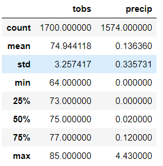
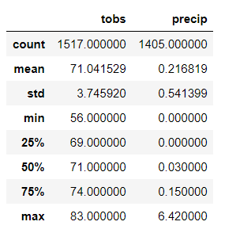

# surfs_up

1. Key statistical data for months of June and December is included below.

| June                | December            |
| ------------------  | ------------------  |
|  |   |
|                     |                     |

It is important to take into account that the dataset contains the period from January 1 2010 till August 23 2017. Year 2017 is not complete.
That is why there are only 1517 temperature measurements for December and while 1700 for June.

Recommendation is to complete dataset with data related to the rest of the year 2017 and obtain the same type of data for 2018, 2019 and 2020.
Another noticeable weakness of this data is that in the entire dataset there are 1447 rows  with missing data for precipitaion, where cells are filled in with NaN.
Ther must be a way to get this missing data.

2. As shown in the table above the mean temperature for June is 74.9 while for December it is 71.0.
 Minimum temperature in June is 64, while in December is 56. Maximum temperature is 85 in June and 83 in December.
 Therefore, June is much warmer month in comparison with December.
 
3. The potential investor in a surf shop had some conserns about the rainy weather. 

Based on key statistical data in terms of precipitaion, it seems that December is pretty rainy month. The maximum amount of rain in December is 6.4 inches, while 6.7 inches is the maximum for the entire year (see climate_analysis.ipynb for reference). The average in December is 0.22 inch while in June it is 0.14 and for the entire year is 0.18. 
December weather brings more than average amount of rain for a year.
 
4. According to lushpalm.com most of the good surf locations are in the North shore of Oahu, while most of the surf shops are in Honolulu.
Next stept in the analysis is to document the exact location of each weather station and give more weight to the data generated by station more close to the surf shop.

