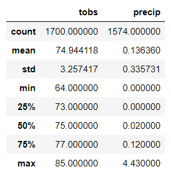

# surfs_up

1. Key statistical data for months of June and December is included below.

| June                | December            |
| ------------------  | ------------------  |
|  |   |
|                     |                     |

It is important to take into account that the dataset contains the period from January 1 2010 till August 23 2017. Year 2017 is not complete.
That is why there are only 1517 temperature measurements for December and while 1700 for June.

Recommendation is to complete dataset with data related to the rest of the year 2017 and obtain the same type of data for 2018, 2019 and 2020.

3. According to lushpalm.com most of the good surf locations are in the North shore of Oahu, while most of the surf shops are in Honolulu.
